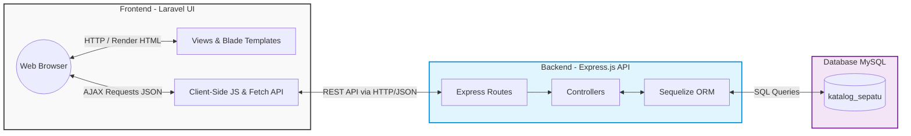
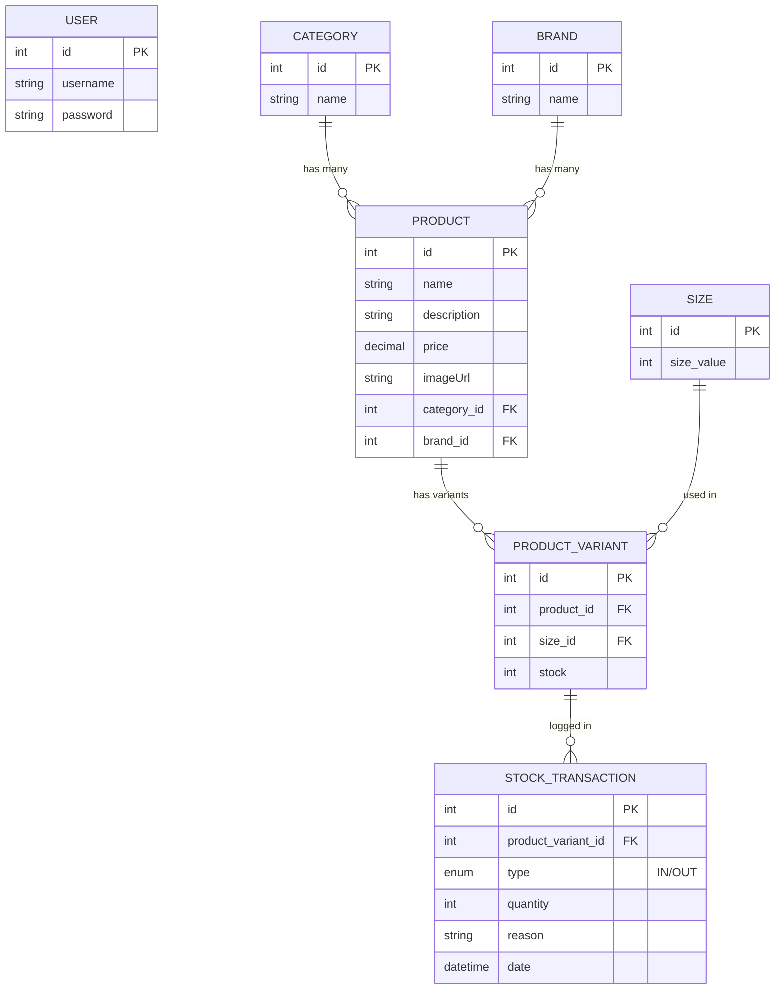
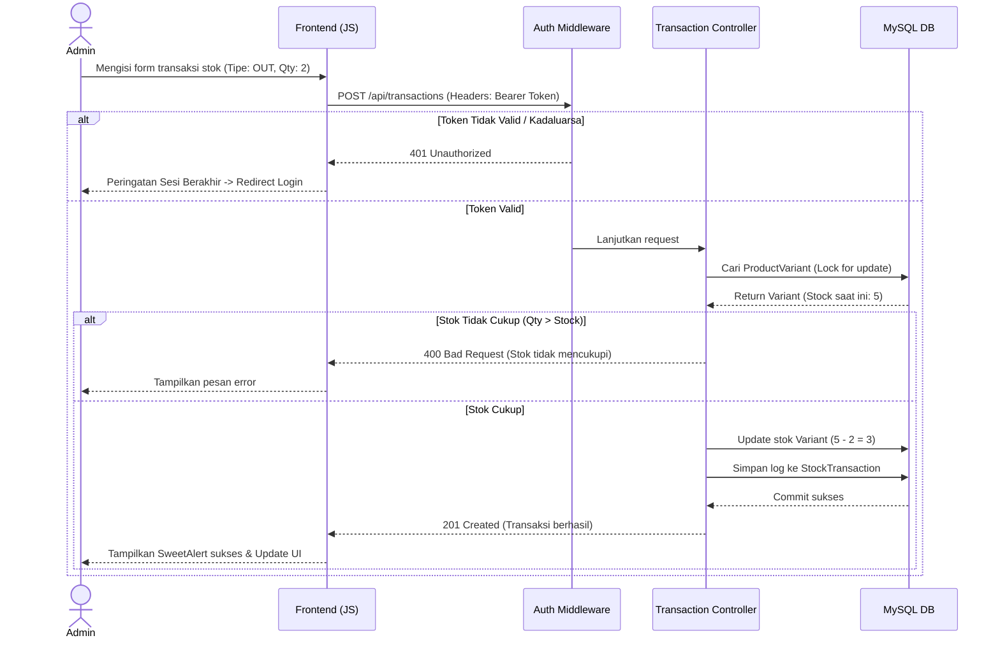

# Cara Kerja Aplikasi Manajemen Katalog Sepatu

Dokumen ini menjelaskan arsitektur, aliran data, dan struktur basis data dari Aplikasi Manajemen Katalog Sepatu melalui diagram visual. Semua diagram di bawah ini dirender menggunakan **Mermaid.js**.

---

## 1. Arsitektur Sistem (System Architecture)

Aplikasi ini menggunakan pola arsitektur **Client-Server** dengan pemisahan penuh antara Frontend (Antarmuka Pengguna) dan Backend (API & Database).

**Penjelasan:**
1. **Frontend** (Berjalan di Port 8000): Laravel hanya bertugas melayani kerangka HTML (Blade). Semua data dinamis diambil oleh JavaScript dari browser (Fetch API).
2. **Backend** (Berjalan di Port 5000): Bertindak sebagai penyedia REST API. Menerima permintaan, memvalidasi _token_ (jika ada), menjalankan logika bisnis, dan berkomunikasi dengan database.
3. **Database**: MySQL menyimpan seluruh state aplikasi yang dijembatani oleh Sequelize ORM di backend.

---

## 2. Entity Relationship Diagram (ERD)

Berikut adalah struktur skema database rasional yang menggerakkan sistem ini. Terdapat relasi kompleks untuk menangani variasi stok sepatu berdasarkan ukuran.

**Penjelasan Relasi Utama:**
- Satu **Product** bisa memiliki banyak **Product_Variant** (contoh: Sepatu A ukuran 40, Sepatu A ukuran 41).
- Stok sebenarnya tidak disimpan di tabel `PRODUCT`, melainkan di tabel `PRODUCT_VARIANT`.
- Setiap kali jumlah stok varian berubah, sebuah rekaman masuk ke dalam **Stock_Transaction** (baik itu `IN` / barang masuk, maupun `OUT` / barang keluar).

---

## 3. Alur Permintaan (Sequence Diagram) - Contoh: Proses Tambah Transaksi Penjualan

Diagram urutan ini mengilustrasikan apa yang terjadi ketika admin menginput penjualan / barang keluar (`OUT`).

**Penjelasan:**
Proses ini diamankan oleh _Database Transaction_. Jika saat menyimpan log transaksi gagal, maka pengurangan stok juga akan dibatalkan (*rollback*), sehingga memastikan data selalu akurat dan tidak _corrupt_.
